---
## Front matter
title: "Отчёт по лабораторной работе 6"
subtitle: "Архитектура компьютера"
author: "Мухамметназар Турсунов"

## Generic otions
lang: ru-RU
toc-title: "Содержание"

## Bibliography
bibliography: bib/cite.bib
csl: pandoc/csl/gost-r-7-0-5-2008-numeric.csl

## Pdf output format
toc: true # Table of contents
toc-depth: 2
lof: true # List of figures
lot: true # List of tables
fontsize: 12pt
linestretch: 1.5
papersize: a4
documentclass: scrreprt
## I18n polyglossia
polyglossia-lang:
  name: russian
  options:
	- spelling=modern
	- babelshorthands=true
polyglossia-otherlangs:
  name: english
## I18n babel
babel-lang: russian
babel-otherlangs: english
## Fonts
mainfont: PT Serif
romanfont: PT Serif
sansfont: PT Sans
monofont: PT Mono
mainfontoptions: Ligatures=TeX
romanfontoptions: Ligatures=TeX
sansfontoptions: Ligatures=TeX,Scale=MatchLowercase
monofontoptions: Scale=MatchLowercase,Scale=0.9
## Biblatex
biblatex: true
biblio-style: "gost-numeric"
biblatexoptions:
  - parentracker=true
  - backend=biber
  - hyperref=auto
  - language=auto
  - autolang=other*
  - citestyle=gost-numeric
## Pandoc-crossref LaTeX customization
figureTitle: "Рис."
tableTitle: "Таблица"
listingTitle: "Листинг"
lofTitle: "Список иллюстраций"
lotTitle: "Список таблиц"
lolTitle: "Листинги"
## Misc options
indent: true
header-includes:
  - \usepackage{indentfirst}
  - \usepackage{float} # keep figures where there are in the text
  - \floatplacement{figure}{H} # keep figures where there are in the text
---

# Цель работы

Целью работы является освоение арифметических инструкций языка ассемблера NASM.

# Выполнение лабораторной работы

## Символьные и численные данные в NASM

Создаю папку для программ лабораторной работы № 6, перехожу в неё и создаю файл lab6-1.asm.

Рассмотрим примеры программ, которые выводят символы и числа. Программы будут выводить значения из регистра eax.

В этой программе в регистр eax записывается символ '6' (инструкция mov eax,'6'), а в регистр ebx — символ '4' (инструкция mov ebx,'4'). Затем к значению в eax добавляется значение из ebx (инструкция add eax,ebx), и результат записывается обратно в eax. После этого выводим результат. 

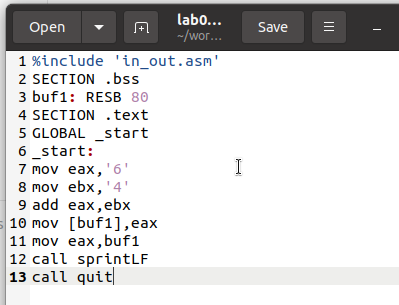{ #fig:001 width=70%, height=70% } 

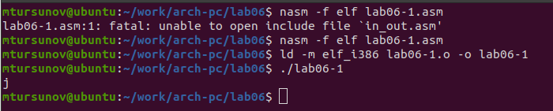{ #fig:002 width=70%, height=70% }

При выводе значения из eax ожидаем увидеть число 10. Однако вместо этого выводится символ 'j'. Это связано с тем, что код символа '6' в двоичном формате — 00110110 (54 в десятичной системе), а код символа '4' — 00110100 (52). После сложения в eax получаем 01101010 (106), что соответствует символу 'j'.

Теперь изменим программу и вместо символов запишем в регистры числа. 

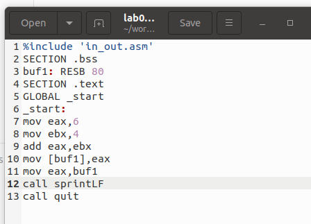{ #fig:003 width=70%, height=70% } 

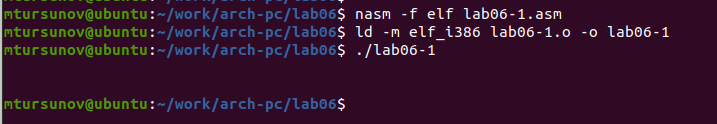{ #fig:004 width=70%, height=70% }

Как и в предыдущем случае, при выполнении программы не получаем число 10. В этот раз выводится символ с кодом 10, что означает конец строки (возврат каретки). В консоли он не отображается, но добавляет пустую строку.

Для работы с числами в файле in_out.asm есть подпрограммы, которые преобразуют символы ASCII в числа и обратно. Изменяем программу, используя эти функции. 

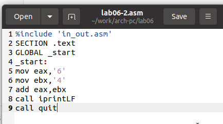{ #fig:005 width=70%, height=70% } 

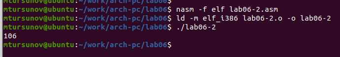{ #fig:006 width=70%, height=70% }

В результате выполнения программы мы получим число 106. Здесь команда add складывает коды символов '6' и '4' (54 + 52 = 106). 
Но, в отличие от предыдущей программы, функция iprintLF выводит число, а не соответствующий ему символ.

Теперь снова изменим символы на числа. 

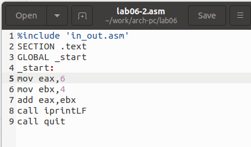{ #fig:007 width=70%, height=70% } 

Функция iprintLF позволяет вывести число, так как операндами являются числа. Поэтому получаем число 10. 

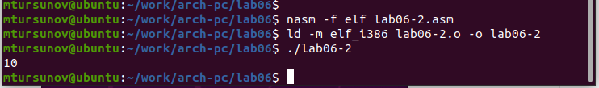{ #fig:008 width=70%, height=70% }

Заменил функцию iprintLF на iprint. Создал исполняемый файл и запустил его. Вывод отличается тем, что нет переноса строки. 

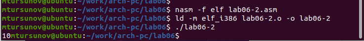{ #fig:009 width=70%, height=70% }

## Выполнение арифметических операций в NASM

Для примера выполнения арифметических операций в NASM рассмотрим программу, вычисляющую выражение $f(x) = (5 * 2 + 3)/3$. 

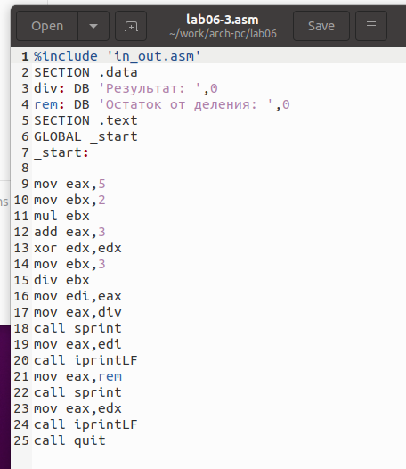{ #fig:010 width=70%, height=70% } 

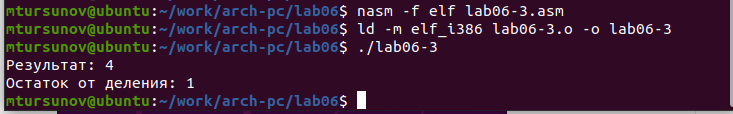{ #fig:011 width=70%, height=70% }

Изменяю программу для вычисления выражения $f(x) = (4 * 6 + 2)/5$. Создаю исполняемый файл и проверяю его работу. 

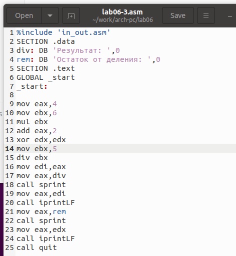{ #fig:012 width=70%, height=70% } 

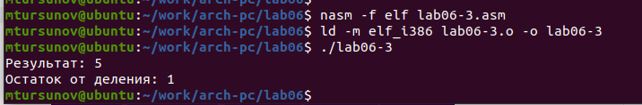{ #fig:013 width=70%, height=70% }

Рассмотрим ещё одну программу, вычисляющую вариант задания по номеру студенческого билета. 

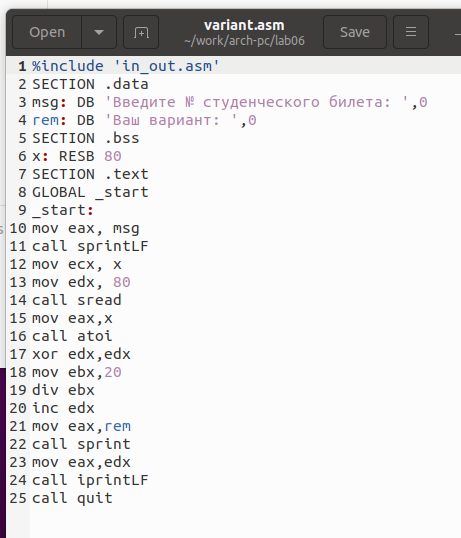{ #fig:014 width=70%, height=70% } 

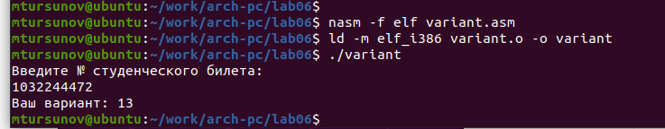{ #fig:015 width=70%, height=70% }

Здесь число, над которым нужно выполнять арифметические операции, вводится с клавиатуры. Поскольку ввод осуществляется в символьном виде, символы нужно преобразовать в числа. Для этого можно использовать функцию atoi из файла in_out.asm.

### Ответы на вопросы

1. Какие строки отвечают за вывод сообщения 'Ваш вариант:'?
   * Инструкция mov eax, rem загружает значение переменной с фразой 'Ваш вариант:' в регистр eax.
   * Инструкция call sprint вызывает подпрограмму для вывода строки.

2. Для чего нужны следующие инструкции?
   * Инструкция mov ecx, x перемещает значение переменной x в регистр ecx.
   * Инструкция mov edx, 80 перемещает значение 80 в регистр edx.
   * Инструкция call sread вызывает подпрограмму для считывания номера студенческого билета из консоли.

3. Для чего нужна инструкция call atoi?
   * Инструкция call atoi используется для преобразования введенных символов в числовой формат.

4. Какие строки отвечают за вычисления варианта?
   * Инструкция xor edx, edx обнуляет регистр edx.
   * Инструкция mov ebx, 20 загружает значение 20 в регистр ebx.
   * Инструкция div ebx делит номер студенческого билета на 20.
   * Инструкция inc edx увеличивает значение регистра edx на 1. Здесь происходит деление номера студенческого билета на 20, а в регистре edx хранится остаток, к которому прибавляется 1.

5. В какой регистр записывается остаток от деления при выполнении div ebx?
   * Остаток от деления записывается в регистр edx.

6. Для чего нужна инструкция inc edx?
   * Инструкция inc edx увеличивает значение в регистре edx на 1, как это предусмотрено формулой для вычисления варианта.

7. Какие строки отвечают за вывод результата вычислений на экран?
   * Инструкция mov eax, edx помещает результат вычислений в регистр eax.
   * Инструкция call iprintLF вызывает подпрограмму для вывода значения на экран.

## Задание для самостоятельной работы

Напишите программу для вычисления выражения $y = f(x)$. Программа должна выводить формулу, запрашивать ввод значения x, вычислять выражение в зависимости от введенного x и выводить результат. Форму функции f(x) выберите из таблицы 6.3 вариантов заданий в соответствии с номером, полученным при выполнении лабораторной работы. Создайте исполняемый файл и проверьте его для значений x1 и x2 из 6.3. 
Получили вариант 13 - $(8x+6)*10$ для $x=1, x=4$. 

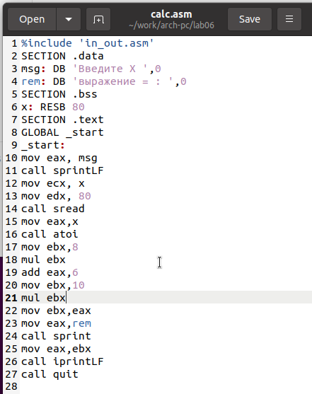{ #fig:016 width=70%, height=70% }

При $x=1$ результат — 140.

При $x=4$ результат — 380. 

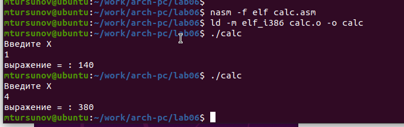{ #fig:017 width=70%, height=70% }

Программа работает корректно.

# Выводы

Изучили работу с арифметическими операциями.